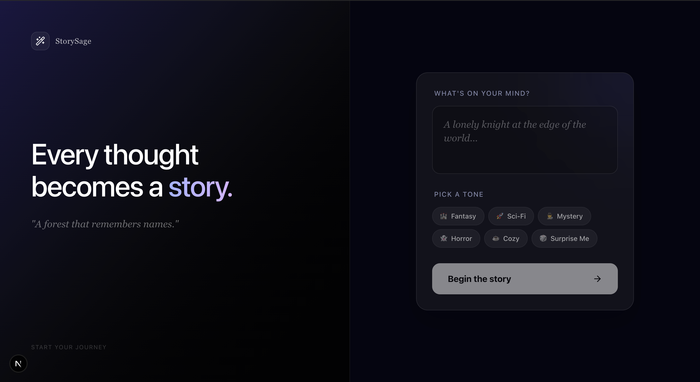
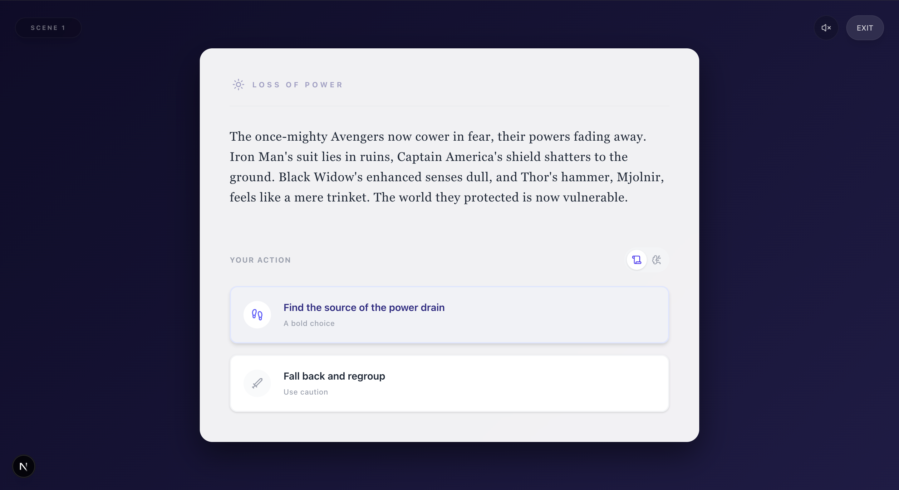
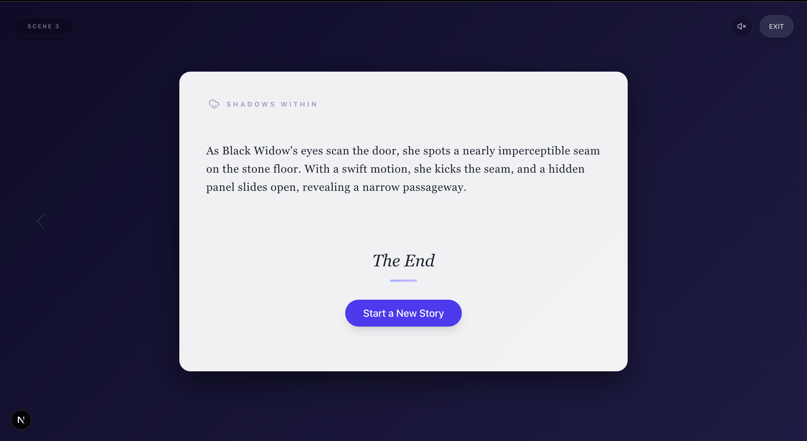

# StorySage

**Every thought becomes a story.**

I designed Story Sage to be an immersive storytelling engine that acts as your personal AI Dungeon Master. It instantly weaves branching narratives based on your choices.

## Screenshots

<p align="center">
  
</p>

<p align="center">
  
</p>

<p align="center">
  
</p>

## Technical Overview

**AI Model :** Groq (Llama 3.1 8b Instant)

**Why I chose it :**
I usually build with Google Gemini because I love its reasoning capabilities. But for this specific demo, I faced a hard constraint: speed and reliability. Gemini's free tier has strict rate limits that could crash the demo during review. I could not risk that. So I switched to Groq. Its LPU engine is fast, and Llama 3.1 allows me to deliver a seamless, instant storytelling experience without worrying about quotas.

**How I implemented the AI :**
I built a service layer that carefully guides the AI. Instead of random text, I force the model to return structured data for every scene using JSON mode. I designed a strict three act structure so every story has a clear beginning, middle, and end. The AI remembers all your previous choices and adapts the plot dynamically. The story is intentionally limited to a three scene arc to deliver a complete narrative while keeping the experience fast, reliable, and free from unnecessary AI calls. I also wrote a custom typewriter effect to make reading feel cinematic.

## Architecture :

I built the entire application with Next.js 15 to keep the frontend and backend unified.

- **Frontend :**
  I used React with Tailwind CSS and Framer Motion to create the smooth, cinematic aesthetic.
- **State Management :**
  I selected Zustand to handle the complex story history and scene transitions cleanly.
- **Security :**
  All AI requests go through server side API routes so my API keys never touch the client browser.

## How to Run Locally

1.  **Clone the repository**

    ```bash
    git clone https://github.com/ankitsjadhav/Dynamic-storytelling.git
    ```

2.  **Install dependencies**

    ```bash
    npm install
    ```

3.  **Set up Environment Variables**
    Create a `.env.local` file in the root directory:

    ```env
    GROQ_API_KEY=your_groq_api_key
    ```

4.  **Run the development server**

    ```bash
    npm run dev
    ```

5.  Open [http://localhost:3000](http://localhost:3000) to start your story.

## Tech Stack

- **Core:** Next.js 15, React 19, TypeScript
- **Styling:** Tailwind CSS, Lucide React
- **Animation:** Framer Motion
- **State Management:** Zustand
- **AI:** Groq (Llama 3.1)
